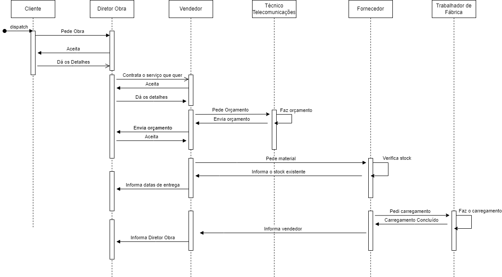
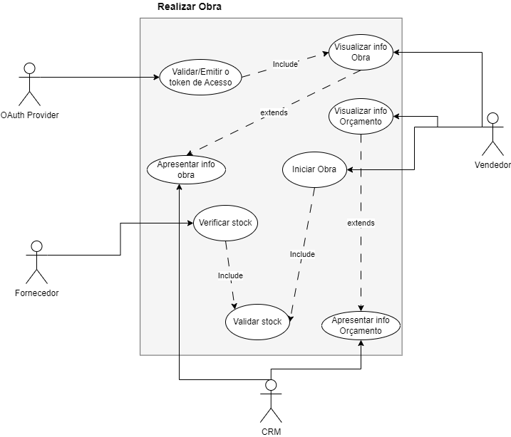
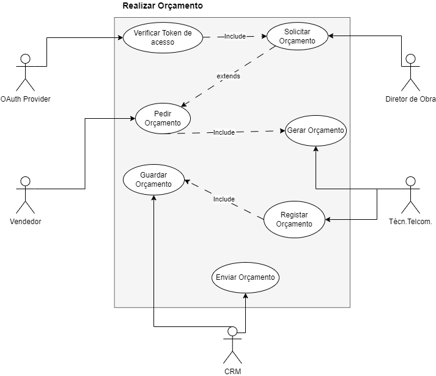
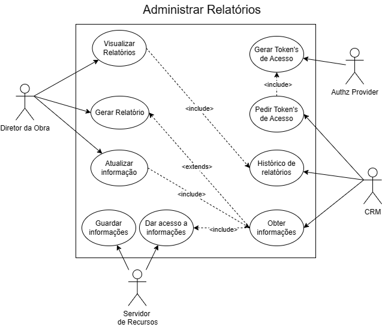
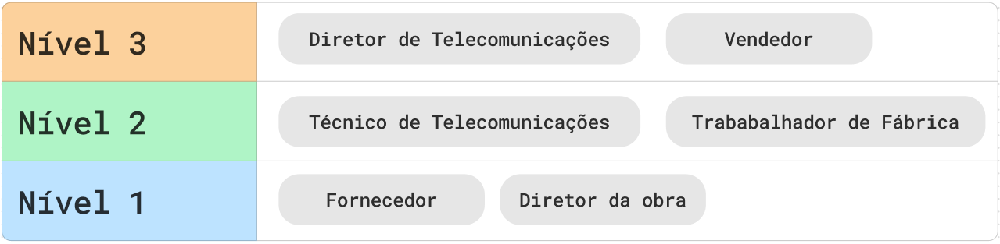
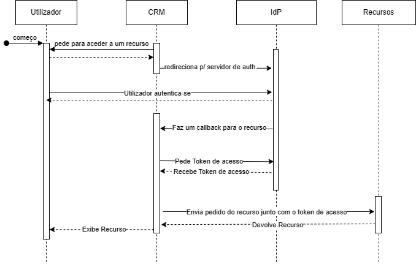
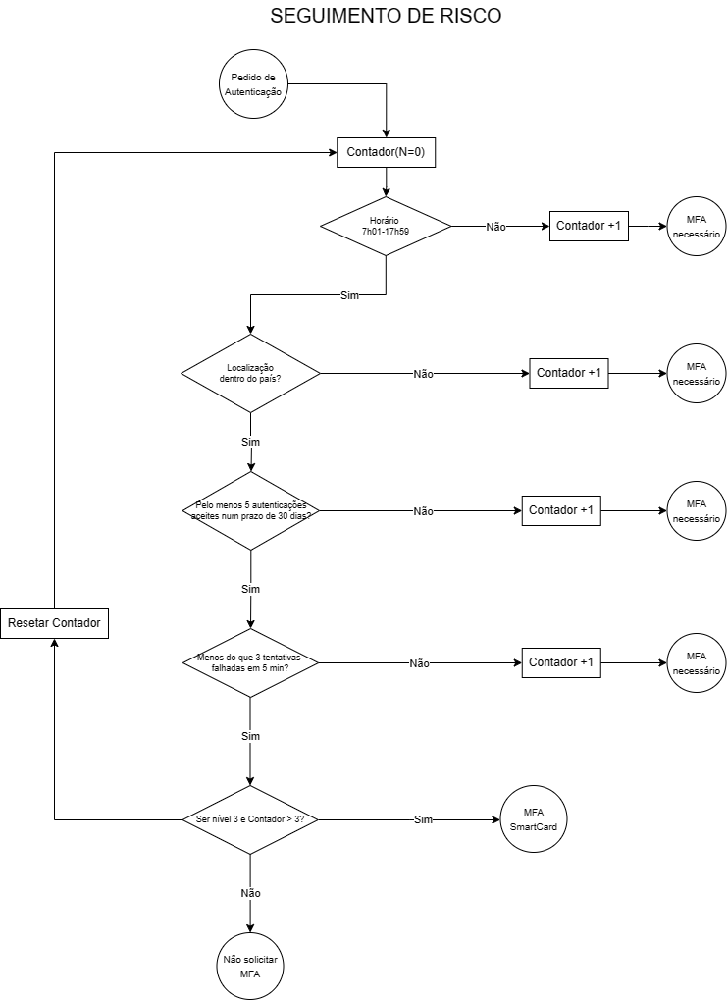
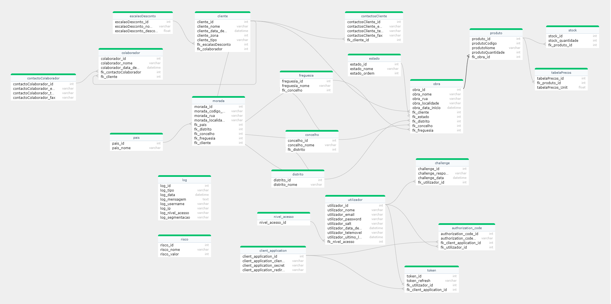
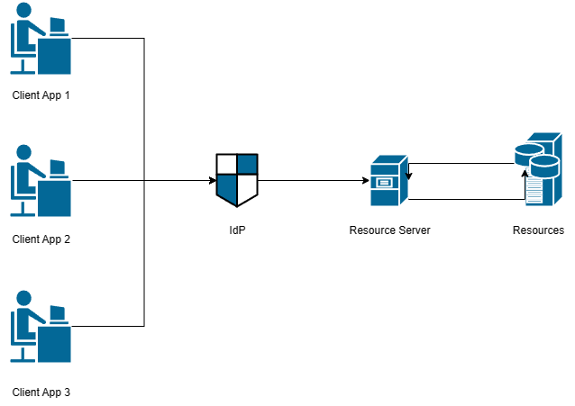
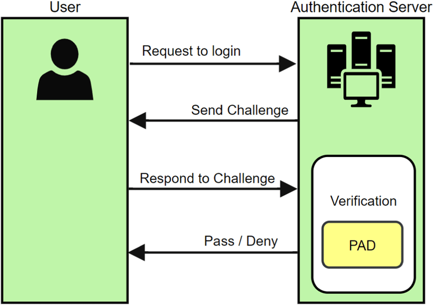

# Trabalho Prático de Integridade, Autenticação e Autorização - Parte 1

O trabalho consiste em desenvolver um *IdP* (*Identity Provider*) que suporte serviços com diferentes graus de criticidade e aplique *MFA* (*Multi-Factor Authentication*), de forma dinâmica, de acordo com os requisitos do serviço e o risco percebido pelo utilizador.

## Membros do Grupo

Este projeto foi desenvolvido por:

- Ana Vidal (118408)
- Simão Andrade (118345)

## Descrição de Serviços

O sistema CRM desenvolvido é uma ferramenta abrangente projetada para gestão todas as facetas dos projetos e atividades de negócios relacionados. 

Uma característica fundamental é a capacidade de gestão um repositório de projetos, fornecendo informações detalhadas sobre cada obra, incluindo dados sobre *stakeholder*'s, contactos com clientes diretos e indiretos (*prospect*'s) que solicitam cotações diretamente à empresa e os materiais necessários para a execução de cada projeto. Além disso, o sistema mantém informações de gestão de clientes, como endereços das sedes e filiais dos clientes.

Além disso, o sistema possui outros componentes de grande relevância como o planeamento, execução e relatório de atividades destinadas a capturar negócios relacionados com os projetos. Isso permite uma abordagem estruturada para angariar e gestão negócios, garantindo que todas as etapas do processo sejam registadas e acompanhadas de forma eficiente.

## Arquitetura do Sistema

A arquitetura do sistema é composta por três componentes principais: o *IdP* (*Identity Provider*), o *Resource Server* e o *Client*.

### Entidades e relações

No sistema descrito, temos as seguintes entidades:
- Diretor da Obra;
- Fornecedor;
- Técnico de Telecomunicações;
- Trabalhador de Fábrica;
- Vendedor.

### Fluxo de interação

De modo a melhor compreender o funcionamento do sistema, foi desenvolvido um diagrama que mostra o fluxo de interação entre os diferentes utilizadores e o sistema, juntamente com alguns casos de uso dos utilizadores.

<p align="center">
  
</p>

<p align="center" style="font-size: 10px;">
  Figura 1: Diagrama de sequencial para a realização de um pedido de orçamento.
</p>

Para uma melhor compreensão das medidas de segurança a se tomar, foi descrito o funcionamento das características principais do sistema, de modo a criar uma solução adequada para o mesmo. Esta descrição foi feita com base em diagramas de caso de uso, obtendo-se os seguintes resultados:

<div style="display: flex; justify-content: center;margin-bottom: 40px;">
    <div>
        
        <p align="center" style="font-size: 10px;">Figura 2: Diagrama de caso de uso para a realização de um pedido de Obra.</p>
    </div>
    <div>
        
        <p align="center" style="font-size: 10px;">Figura 3: Diagrama de caso de uso para a realização de um pedido de orçamento.</p>
    </div>
</div>

<div style="display: flex; justify-content: center;">
    <div>
        
        <p align="center" style="font-size: 10px;">Figura 4: Diagrama de caso de uso para a gestão de relatórios.</p>
    </div>
</div>


### Controlo de Acesso

O sistema foi desenvolvido com base no controlo de acesso, de forma a garantir que os utilizadores apenas têm acesso aos recursos que são necessários para a realização das suas tarefas.

#### Níveis de Acesso

Como o sistema é composto por diversos tipos de utilizados, onde os mesmos acedem a diferentes recursos para desempenhar as suas funções, terá que ser implementado um controlo de acesso que permita a cada utilizador aceder apenas aos recursos necessários para a realização das suas tarefas.

Com base nas funções desempenhadas pelos utilizadores do sistema e sensibilidade dos recursos acedidos, foi desenvolvida a seguinte **hierarquia de acesso**:

<p align="center">
  
</p>

<p align="center" style="font-size: 10px;">
  Figura 5: Hierarquia de acesso dos utilizadores.
</p>

Sendo, o **Nível 3** o acesso **mais restrito** e o **Nível 1** o acesso **mais permissivo**.

#### Regras de Confidencialidade

1. **Regra de Não-Leitura (No Read Up):** Esta regra impede que indivíduos em níveis de segurança mais baixos acessem informações em níveis de segurança mais altos, evitando assim a divulgação não autorizada de informações sensíveis. Por exemplo:
   - Um vendedor, um diretor de obra, um fornecedor, um técnico de telecomunicações e um trabalhador de fábrica, todos eles possuem permissão para aceder informações sobre clientes, diretores de obra, moradas e contatos de clientes, moradas da obra, materiais da obra, tabelas de preços e status da obra. No entanto, nenhum deles pode aceder a informações sobre materiais em stock ou escalões de desconto, pois essas informações são consideradas mais sensíveis e podem afetar a segurança e a integridade do sistema se divulgadas a pessoas não autorizadas.

1. **Regra de Não-Escrita (No Write Down):** Esta regra impede que informações em níveis de segurança mais altos sejam gravadas em níveis de segurança mais baixos, garantindo assim a proteção das informações confidenciais. Por exemplo:
   - Um vendedor, um diretor de obra, um fornecedor, um técnico de telecomunicações e um trabalhador de fábrica podem fornecer informações sobre clientes, diretores de obra, moradas e contatos de clientes, moradas da obra, materiais da obra, tabelas de preços e status da obra, mas nenhum deles pode registrar informações sobre materiais em stock ou escalões de desconto em um sistema de segurança mais baixo. Isso evita que informações sensíveis sejam divulgadas a partes não autorizadas e mantém a integridade e a confidencialidade do sistema.

Essas regras garantem que apenas as pessoas autorizadas tenham acesso e permissão para visualizar e modificar informações relevantes, protegendo assim a confidencialidade e a segurança dos dados no sistema.

#### Regras de Integridade

1. **Regra de Não-Escrita (Não Acrescentar):** Esta regra é crucial para evitar que informações sensíveis ou críticas sejam alteradas por indivíduos que não têm autorização para fazê-lo. Por exemplo:
   - Um vendedor pode precisar aceder a informações sobre clientes, diretores de obra e materiais, mas não deve ter permissão para modificar detalhes sobre a obra, fornecedores, tecnologia de telecomunicações ou trabalho de fábrica, pois isso pode interferir nas operações internas.
   - Um diretor de obra pode precisar atualizar informações sobre a obra, mas não deve ter permissão para modificar detalhes sobre fornecedores, tecnologia de telecomunicações ou trabalho de fábrica, pois isso pode afetar os processos de aquisição e comunicação.
   - Um fornecedor pode fornecer informações sobre materiais, mas não deve ter permissão para alterar detalhes sobre tecnologia de telecomunicações ou trabalho de fábrica, pois isso pode comprometer a integridade dos dados de produção.

2. **Regra de Não-Leitura (Não Visualizar para Baixo):** Esta regra impede que informações confidenciais sejam acessadas por indivíduos que não têm autorização para fazê-lo. Por exemplo:
   - Os trabalhadores da fábrica podem precisar aceder a informações sobre materiais em stock e escalões de desconto para realizar suas funções, mas não devem ter permissão para visualizar dados sobre clientes, diretores de obra ou fornecedores, pois isso pode expor informações confidenciais a pessoal não autorizado.
   - Da mesma forma, os técnicos de telecomunicações podem precisar de acesso a informações sobre materiais em stock e escalões de desconto para fins de manutenção, mas não devem ter permissão para visualizar dados sobre clientes, diretores de obra ou fornecedores, pois isso pode comprometer a segurança das informações.

Estas regras garantem que apenas as pessoas autorizadas tenham acesso e permissão para modificar informações relevantes, mantendo assim a integridade e a segurança dos dados no sistema.

#### Mapeamento de recursos

Para a implementação do controlo de acesso, foi feito um enumeração dos recursos que cada tipo de utilizador pode aceder.

Com isto, foi definida a seguinte estrutura baseada:

| Acessos                         | Vendedor | Dir. da Obra | Fornecedor | Tec. Telecom | Trab. de Fábrica |
| ------------------------------- | -------- | ------------ | ---------- | ------------ | ---------------- |
| Morada e contactos dos Clientes | Sim      | Sim          | Não        | Não          | Não              |
| Contactos do diretor da obra    | Sim      | -            | Sim        | Não          | Não              |
| Morada da obra                  | Sim      | Sim          | Não        | Não          | Não              |
| Material da obra                | Sim      | Sim          | Sim        | Sim          | Sim              |
| Material em stock               | Não      | Não          | Sim        | Não          | Sim              |
| Tabela de preços                | Sim      | Sim          | Sim        | Não          | Não              |
| Escalão de desconto             | Sim      | Não          | Não        | Sim          | Não              |
| Status da obra                  | Sim      | Sim          | Não        | Não          | Não              |

## *Authentication* e *Authorization flow*

A *framework* OAuth 2.0 diversos modos de obter tokens de acesso e como estes são geridos no processo de autenticação. A escolha do fluxo de autenticação depende do tipo de aplicação, nível de confiança com a aplicação cliente e a fadiga do utilizador.

Para obter uma melhor resposta a qual *flow* de autenticação usar, foram feitas as seguintes questões:

### A aplicação cliente é uma *SPA* (*Single-Page App*)?

Dada a abundância de dados envolvidos, o sistema foi desenvolvido como uma *MPA* (*Multi-page App*). Isso garante que a complexidade de desenvolvimento seja mantida baixa, enquanto proporciona um tempo de carregamento inicial rápido. Isso significa que os utilizadores podem acessar informações de maneira mais imediata, sem sacrificar a eficiência ou a usabilidade do sistema.

### A aplicação cliente é o *Resource Owner*?

Como a solução da aplicação cliente é uma aplicação *web*, a abordagem onde o *Resource Owner* é o *Client* não é a mais adequada. Isso porque a aplicação cliente não é confiável com as credenciais do utilizador, podendo trazer riscos de segurança.

### A aplicação cliente é um *Web Server*?

Sim, a aplicação cliente é um *Web Server*.

### A aplicação cliente precisa de comunicar com *Resource Servers* diferentes?

Não, a aplicação cliente apenas precisa de comunicar com o *Resource Server* empresa.

Dados os requisitos do sistema e feita a análise das questões acima, o *flow* de autenticação escolhido foi o *Authorization Code*.

### Diagrama de *Authorization Code*

O seguinte diagrama mostra o processo autenticação do sistema, usando o *Authorization Code flow*:

<p align="center">
  
</p>

<p align="center" style="font-size: 10px;">
  Figura 6: Diagrama de sequencial para o *Authorization Code flow*.
</p>

## Modelo de gestão de risco

De modo a garantir a segurança do sistema, foi desenvolvido um modelo de gestão de risco que permite identificar, avaliar e mitigar os riscos associados ao sistema, variando consoante o nível de acesso do utilizador.

### Identificação de riscos

Para a identificação dos riscos associados ao sistema, foi feita uma enumeração das possíveis ameaças e vulnerabilidades que podem afetar a segurança do sistema.
- **Ameaças**:
  1. Comprometimento de dados sensíveis;
  2. Acesso de colaborados a documentos sensíveis;
  3. Integridade dos dados comprometida;
  4. Exposição de informações sensíveis;
  5. Roubo de credenciais.
- **Vulnerabilidades**:
  1. Ataques de *phishing* (roubo de credenciais);
  2. Regras de controlo de acesso mal definidas;
  3. Falta de validação de *inputs*;
  4. Ataques *password spraying*;
  5. Ataques de *Broken Authentication*.

### Análise/Avaliação de riscos do software

A partir desta enumeração, foi feita uma **análise quantitativa** de risco para determinar a probabilidade de ocorrência e o impacto de cada risco identificado. 

Onde a **matriz de risco** é a seguinte:

| Probabilidade/Impacto | Muito Baixo | Baixo | Médio | Alto  | Muito Alto |
| --------------------- | :---------: | :---: | :---: | :---: | :--------: |
| Improvável            |      1      |   2   |   3   |   4   |     5      |
| Pouco provável        |      2      |   4   |   6   |   8   |     10     |
| Provável              |      3      |   6   |   9   |  12   |     15     |
| Bastante provável     |      4      |   8   |  12   |  16   |     20     |
| Muito provável        |      5      |  10   |  15   |  20   |     25     |

Cuja **probabilidade** representa:

| Nível de probabilidade |     Descrição     | Número médio de Ocorrências |
| ---------------------- | :---------------: | :-------------------------: |
| Nível 1                |    Improvável     |             0-1             |
| Nível 2                |  Pouco provável   |             1-2             |
| Nível 3                |     Provável      |             2-3             |
| Nível 4                | Bastante provável |             3-4             |
| Nível 5                |  Muito provável   |             4+              |

Cujo **impacto** representa:

| Nível de impacto |   Impacto   |      Descrição do impacto       |
| ---------------- | :---------: | :-----------------------------: |
| Nível 1          | Muito Baixo |   Um posto de trabalho parado   |
| Nível 2          |    Baixo    |   Um sistema/processo parado    |
| Nível 3          |    Médio    |     Um departamento parado      |
| Nível 4          |    Alto     | Mais que um departamento parado |
| Nível 5          | Muito Alto  |        A empresa parada         |


Obtendo-se a seguinte **tabela de risco**:

| Risco = f(Ameaça, Vulnerabilidade)                                          | Probabilidade | Impacto | Valor do Risco = (P * I) |
| --------------------------------------------------------------------------- | :-----------: | :-----: | :----------------------: |
| Comprometimento de dados sensíveis causados por *phishing*                  |       4       |    3    |            12            |
| Acesso de colaborados a documentos sensíveis, por privilégios mal definidos |       1       |    2    |            2             |
| Integridade dos dados comprometida por falta de validação de entrada        |       4       |    4    |            16            |
| Exposição de informações sensíveis devido a falha na autenticação           |       3       |    4    |            12            |
| Roubo de credenciais devido a ataques de força bruta                        |       3       |    4    |            12            |

### Identificação de controlos a implementar

Com base nos riscos anteriormente enumerados, foram identificados os controlos a implementar para mitigar os mesmos. 

A presente tabela, mostra os controlos identificados junto do novo valor do risco:

| Risco = f(Ameaça, Vulnerabilidade)                                          | Controlo a implementar                                                   | Probabilidade(2) | Impacto(2) | Valor do Risco (Novo) |
| --------------------------------------------------------------------------- | ------------------------------------------------------------------------ | :--------------: | :--------: | :-------------------: |
| Comprometimento de dados sensíveis causados por *phishing*                  | Uso de autenticação *MFA*                                                |        2         |     3      |           6           |
| Acesso de colaborados a documentos sensíveis, por privilégios mal definidos | Definição de políticas de controlo de acesso                             |        1         |     1      |           1           |
| Integridade dos dados comprometida por falta de validação de entrada        | Implementação de validação de *inputs*                                   |        3         |     3      |           9           |
| Exposição de informações sensíveis devido a falha na autenticação           | Gestão de *tokens* de autenticação                                       |        2         |     3      |           6           |
| Roubo de credenciais devido a ataques de força bruta                        | Implementação de bloqueio de contas/*timeout*'s após tentativas falhadas |        2         |     3      |           6           |


Agora, podemos realizar uma avaliação de risco semelhante à anterior, atribuindo valores de probabilidade e impacto para esses riscos e calculando a pontuação de risco total.

| Risco                                           | Probabilidade | Impacto | Valor do Risco = (P * I) |
| ----------------------------------------------- | :-----------: | :-----: | :----------------------: |
| Exposição de informações do cliente             |       3       |    4    |            12            |
| Acesso não autorizado às informações das vendas |       4       |    3    |            12            |
| Risco de phishing                               |       3       |    3    |            9             |
| Fraude de identidade                            |       2       |    2    |            4             |

### Autenticação de dois fatores (MFA)

#### Métodos escolhidos
O sistema de autenticação irá ter os seguintes modos de autenticação:
- **Autenticação via palavra-passe**: Será pedido ao utilizador que insira as credencias;
- **Autenticação via *One-Time Password***: Será enviado um código de autenticação para o email/aplicação móvel do utilizador;
- **PIN**: Serão feitas PIN ao utilizador que foram solicitadas no registo;
- **Autenticação via *Smartcard***: Será pedido ao utilizador que insira o seu cartão de autenticação.

#### Motivação para a escolha dos métodos

1. **Exposição de informações do cliente e acesso não autorizado às informações de vendas:** A autenticação através de One-Time Password (OTP) é uma escolha adequada, pois oferece um segundo fator de autenticação que é dinâmico e não pode ser facilmente forjado por atacantes, pois têm de ter acesso a um dispositivo fisico do utilizador ou credencias de acesso de uma outra aplicação de vinculo de autenticação do mesmo.

2. **Risco de phishing e fraude de identidade:** As PIN são úteis para mitigar o risco de phishing e fraude de identidade, pois adicionam uma camada extra de verificação da identidade do utilizador, sendo que só o utilizador legítimo conhece, dificultam então, a realização de ataques de phishing bem-sucedidos ou tentativas de fraude de identidade.

3. **Nível de segurança geral e diversificação de métodos:** A autenticação através de Smartcard é uma opção de decrescimo ao nível da usabilidade, mas para os utilizadores que precisam de um nível mais elevado de segurança, especialmente para acesso a informações sensíveis ou operações críticas. O uso de cartões de autenticação físicos adicionam uma camada adicional de proteção, pois requer que os utilizadores tenham posse física do seu cartão para autenticar-se.

#### Gestão dos pedidos de autenticação

Além do risco variar consoante o nível de acesso do agente, o mesmo também poderá variar dependendo do:
- IP de origem do pedido;
- Hora do pedido;
- Tipo de dispositivo;
- Localização do dispositivo;
- Número de tentativas de autenticação falhadas;
- Nível de confiança do dispositivo (número de vezes que o dispositivo foi usado para autenticação bem-sucedida).

Estas variáveis serão avaliadas usando os *logs* de autenticação e, com base nisso, será pedido ou não uma segunda via de autenticação.

**Para todos os níveis de acesso definimos as seguintes regras:**
- Hora do pedido: Fora do horário de trabalho (19h - 7h); 
- Endereço IP/Localização: Fora do país;
- Número de tentativas de autenticação falhadas: 3 ou mais, num intervalo de 5 minutos;
- Nível de confiança do dispositivo: pelo menos 5 autenticações bem-sucedidas num intervalo de 30 dias. 
  
**Nível 1**: Um pedido de autenticação MFA, se as pelo menos uma das regras acima não for seguida;

**Nível 2**: Dois pedidos de autenticação MFA, se pelo menos duas das regras acima não forem seguidas;

**Nível 3**: É sempre exigido um pedido de autenticação MFA, mas caso todas as regras acima não sejam seguidas, é exigido uma autenticação física.

As regras descritas encontram-se representadas no seguinte diagrama:

<p align="center">
  
</p>

<p align="center" style="font-size: 10px;">
  Figura 7: Diagrama de estados para a gestão de autenticação.
</p>


# Trabalho Prático de Integridade, Autenticação e Autorização - Parte 2

Esta segunda parte do trabalho abarca o processo de implementação do sistema CRM com controlo de acessos e sistema de autenticação descrito na primeira parte.

## Ferramentas Utilizadas

Para a implementação do sistema, foram utilizadas as seguintes ferramentas:
- **Python**: Linguagem de programação utilizada para o desenvolvimento do *backend* da aplicação;
- **Flask**: *Framework* de desenvolvimento web utilizado para a criação do *backend* da aplicação;
- **SQLite**: Sistema de gestão de base de dados utilizado para a criação e gestão da base de dados da aplicação;
- **HTML/CSS/JS**: Linguagens de marcação e estilização utilizadas para o desenvolvimento do *frontend* da aplicação;

Dentro da linguagem de programação Python, foram utilizadas as seguintes bibliotecas:
- **JWT**: Biblioteca utilizada para a criação e validação de *tokens* de autenticação;
- **Authlib**: Biblioteca utilizada para a implementação do *OAuth 2.0*;
- **SQLite3**: Biblioteca utilizada para a criação e gestão da base de dados da aplicação.

Além disso foi utilizado:
- **Postman**: Ferramenta utilizada para a realização de testes de *endpoints* e validação de *tokens*.
- **Figma**: Ferramenta utilizada para a criação de *wireframes* e *mockups* do *frontend* da aplicação.

A escolha destas ferramentas foi feita com base na sua facilidade de uso, documentação extensiva e suporte ativo.

## Base de Dados

Com base na descrição do sistema das entidades e relações feita na primeira parte do trabalho, foi desenvolvida uma base de dados que reflete a estrutura do sistema CRM.

<p align="center">
  
</p>
<p align="center" style="font-size: 10px;">
  <i>Figura 8 - Diagrama Entidade-Relação da Base de Dados</i>
</p>

> O mesmo encontra-se armazenados neste repositório, na diretoria `server/database/`.

## Arquitetura do Sistema

A arquitetura encontra-se dividida em três componentes principais: 
- **Client's**: Onde se encontra o *frontend* das aplicações;
- **IdP**: Onde se encontra o *backend* da aplicação, responsável pela autenticação e autorização dos utilizadores;
- **Resource Server**: Onde se encontra o *backend* da aplicação, responsável pela gestão dos recursos e controlo de acessos.

Cada *Client* tem acesso a diferentes recursos, e o seu acesso é condicionado pelo *IdP* e *Resource Server*.

Temos três *Client's* com as seguintes funcionalidades:
1. Visualização do material da obra;
2. Gestão do material em stock e utilizado por obra;
3. Gestão de moradas e contactos dos clientes, diretores de obra e gestão de preços.

A estrutura do projeto encontra-se organizada da seguinte forma:

<p align="center">
  
</p>
<p align="center" style="font-size: 10px;">
  <i>Figura 9 - Diagrama de Implementação</i>
</p>

### Fluxo de mensagens

Deste modo, sempre que o utilizador tenta **autenticar-se**, o fluxo de mensagens é o seguinte:
1. *Client* **redireciona** o utilizador para o *IdP* para autenticação, enviando o `client_id`, `response_type`, `redirect_uri` e `scope` (*authorization endpoint*);
2. *IdP* **autentica** o utilizador e **redireciona** (usando o `redirect_uri`) o utilizador para o *Client* com o `authorization_code`;
3. Já com o `authorization_code`, o *Client* **envia** um pedido para o *IdP* para obter o *token* de acesso (*token endpoint*), em conjunto com o `client_id`, `client_secret`, `grant_type` e `redirect_uri`;
4. *IdP* **verifica** o `authorization_code` e **envia** o *token* de acesso para o *Client*;

Sempre que um cliente tenta **aceder a um recurso**, o fluxo de mensagens é o seguinte:
1. *Client* **envia** o *token* para o *Resource Server* sempre que tenta aceder a um recurso. 
2. *Resource Server* **valida o acesso e a integridade** do *token* e, caso seja válido, envia o recurso pedido.
3. *Client* **recebe** o recurso pedido.

> Este fluxo de mensagens encontra-se representado no diagrama presente na Figura 6.

## Implementação

### *Client Applications*

TODO: Escrever sobre o *Client* e a sua implementação.

### Armazenamento e Auditoria de *Logs*

Os *logs*, tanto de autenticação (*Authorization Server*) como de acesso a recursos (*Resource Server*), são guardados na base de dados, contendo as seguintes informações, consoante o propósito do *log*:

| Informação                    | Auditoria | Análise de Risco |
| ----------------------------- | :-------: | :--------------: |
| Data e hora do pedido         |     x     |        x         |
| IP de origem do pedido        |     -     |        x         |
| Sucesso ou falha do pedido    |     x     |        x         |
| Tipo de pedido                |     x     |        x         |
| Nível de acesso do utilizador |     x     |        x         |
| Nome do utilizador            |     -     |        x         |

Existem dois tipos de *logs*:
- `ERROR`: *Logs* de erro, que contêm informações sobre pedidos que falharam;
  - `AUTHENTICATION_ERROR`: *Logs* de erro de autenticação, que contêm informações sobre pedidos de autenticação que falharam;
  - `ACCESS_ERROR`: *Logs* de erro de acesso, que contêm informações sobre pedidos de acesso a recursos que falharam.
- `INFO`: *Logs* de informação, que contêm informações sobre pedidos bem-sucedidos.
  - `AUTHENTICATION_INFO`: *Logs* de informação de autenticação, que contêm informações sobre pedidos de autenticação bem-sucedidos;
  - `ACCESS_INFO`: *Logs* de informação de acesso, que contêm informações sobre pedidos de acesso a recursos bem-sucedidos.

### *Identity Provider*

#### *Challenge-Response*

Existem três tipos de **provas de autenticação**: 
- **Algo que o utilizador sabe**: *passwords*, *PINs*, etc.;
- **Algo que o utilizador tem**: *smartcards*, *tokens*, etc.;
- **Algo que o utilizador é**: impressões digitais, reconhecimento facial, etc.

Nesta a implementação do *Challenge-Response*, é feita uma abordagem com base em PIN enviado por SMS (**algo que o utilizador sabe**). Para isso foi guardada na base de dados, uma tabela com o *challenge response* de cada utilizador com a respetiva data e hora de criação.

> Estas mensagens SMS são enviadas através da API da Twilio.

Durante a autenticação, é enviado um *challenge* ao utilizador, neste caso um nonce (*number used once*), que é uma string aleatória gerada pelo *IdP*. O utilizador responde com o PIN recebido, junto com o *nonce*, sendo estes computados com uma função *digest* (SHA-256) e comparados com os valores guardados na base de dados.

Este fluxo encontra-se representado no seguinte diagrama:

<p align="center">
  
</p>
<p align="center" style="font-size: 10px;">
  <i>Figura 10 - Representação do protocolo de autenticação Challenge-Response</i>
</p>

#### OTP (*One-Time Password*)

Para a implementação, foi utilizado a biblioteca `pyotp`, que permite a criação de códigos de autenticação com base no algoritmo `TOTP` (*Time-based One-Time Password*). Este algoritmo gera um código de autenticação que é válido apenas por um curto período de tempo, no caso **90 segundos**, e é gerado com base numa *seed* e no tempo atual.

O seguinte código mostra a geração de um código de autenticação, que recebe como argumentos a *seed* (que será a credencial do utilizador) e o email do utilizador e devolve o código e o URI para a criação de um *QR Code*, compatíveis com aplicações como o *Google Authenticator*:

```python
from pyotp import TOTP

def create_totp(seed: str, email_address: str):
    totp = TOTP(seed)
    totp_code = totp.now()
    uri = totp.provisioning_uri(name=email_address, issuer_name='CRM IAA')
    return totp_code, uri
```

O *QR code* é gerado com base no URI, usando a biblioteca `qrcode`, e é guardado num *buffer* de imagem para ser enviado ao utilizador por email.

Para mandar o código de autenticação e o *QR code* por email, foi criada uma conta da Google para o envio de emails.

> Informação sobre como criar uma palavra-passe para a aplicação: [Google - Criar uma palavra-passe para a aplicação](https://support.google.com/mail/answer/185833?hl=pt)

E foi utilizada a biblioteca `smtplib` para o envio de emails sobre o domínio do Gmail (`smtp.gmail.com`).

### *Resource Server*

#### Validação de *Tokens*

Para validar os *tokens* de acesso, o *Resource Server* verifica a assinatura do *token* através de JWKS (*JSON Web Key Set*), que contém as chaves públicas do *IdP*. Envolve a criação de um *endpoint* que retorna as chaves públicas do *IdP* usadas para assinar os *tokens* usando o algoritmo `RS256`.

Exemplo de um *JWKS*: 
```json
{
  "keys": [
      {
        "alg": "RS256",
        "e": "AQAB",
        "kid": "authorization-server-key",
        "kty": "RSA",
        "n": "txlzMo9bXTK-hCe8hKA0D2HR9imD0Xi_DtZrSGMwIehitrD_9H2EyBt50k5wBoS9s3Fnt42IdU09v8oR6gQ8EFWK7yndbDgk8ADeKWtM1x0w7N20ClmI-hd9yPABIwXfVuMfsX1eBA09_9xGiiXDw7sFRnQD8mYPFWp8AsNqCWfz2Fl7y3PbBFYS2IBAG_mFd9MLgQhUPttASQ0biPQRQ7ORAp0Xm27OfKrO5Ukpuv-36-luKtLI-1IwZ5mRr0OXqbiKINfMoa80TLfk77MMImj49genPeCAJq-obVFk4pboHkXZ0XmY0X4v_BgCM4GZ53Sd8VI3F-i_KpJWcIgunQ",
        "use": "sig"
      }
  ]
}
```

> Mais informação sobre este *standard* (RFC 7517): [Auth0 - JSON Web Key Set (JWKS)](https://auth0.com/docs/secure/tokens/json-web-tokens/json-web-key-sets)

Ficheiro .PEM correspondente à chave pública:
```pem
-----BEGIN PUBLIC KEY-----
MIIBIjANBgkqhkiG9w0BAQEFAAOCAQ8AMIIBCgKCAQEAtxlzMo9bXTK+hCe8hKA0
D2HR9imD0Xi/DtZrSGMwIehitrD/9H2EyBt50k5wBoS9s3Fnt42IdU09v8oR6gQ8
EFWK7yndbDgk8ADeKWtM1x0w7N20ClmI+hd9yPABIwXfVuMfsX1eBA09/9xGiiXD
w7sFRnQD8mYPFWp8AsNqCWfz2Fl7y3PbBFYS2IBAG/mFd9MLgQhUPttASQ0biPQR
Q7ORAp0Xm27OfKrO5Ukpuv+36+luKtLI+1IwZ5mRr0OXqbiKINfMoa80TLfk77MM
Imj49genPeCAJq+obVFk4pboHkXZ0XmY0X4v/BgCM4GZ53Sd8VI3F+i/KpJWcIgu
nQIDAQAB
-----END PUBLIC KEY-----
```

> Conversor de JWK para PEM: [JWK to PEM](https://8gwifi.org/jwkconvertfunctions.jsp)

No *Resource Server*, é feita a validação do *token* de acesso, verificando a assinatura do *token* com a chave pública do *IdP*, da seguinte forma:

```python
def verify_token(f):
    @wraps(f)
    def wrapper(*args, **kwargs):
        token = request.headers.get('Authorization')
        if not token:
            return jsonify({'error_message': 'Missing Authorization header'}), STATUS_CODE['UNAUTHORIZED']

        token = token.split(' ')[1]
        public_key = get_public_key()
        try:
            decoded_token = jwt.decode(token, public_key, algorithms=['RS256'])
            request.decoded_token = decoded_token
            return f(*args, **kwargs)
        except jwt.ExpiredSignatureError:
            return jsonify({'error_message': 'Token has expired'}), STATUS_CODE['UNAUTHORIZED']
        except jwt.InvalidTokenError:
            return jsonify({'error_message': 'Invalid token'}), STATUS_CODE['UNAUTHORIZED']
    return wrapper
```

Este *decorator* é aplicado a todos os *endpoints* que requerem autenticação (`@verify_token`), garantindo que apenas pedidos com *tokens* válidos têm acesso aos recursos.

## Testes de Validação

TODO: Ainda não chegamos cá...

### *Endpoints*

### Validação de *Tokens*

### Pedidos de Autenticação MFA

### Pedidos ao *Resource Server*

## Conclusão

TODO: Em suma, blah blah blah...

## Referências

- [Github - challenge-response-authentication example](https://github.com/abhisheklolage/challenge-response-auth/)
- [Auth0 - JSON Web Key Set (JWKS)](https://auth0.com/docs/secure/tokens/json-web-tokens/json-web-key-sets)
- [Authlib Documentation](https://docs.authlib.org/en/latest/)
- [PyOTP Documentation](https://pyauth.github.io/pyotp/)
- [QRCode Documentation](https://pypi.org/project/qrcode/)
- [Auth0 - Authorization Code Flow](https://auth0.com/docs/flows/authorization-code-flow)
- [Auth0 - Which OAuth 2.0 Flow Should I Use?](https://auth0.com/docs/get-started/authentication-and-authorization-flow/which-oauth-2-0-flow-should-i-use)
- [JWT.io](https://jwt.io/)
- [Bootstrap](https://getbootstrap.com/)
- [Flask Documentation](https://flask.palletsprojects.com/en/2.0.x/)
- [Twilio - Verify API](https://www.twilio.com/docs/libraries/reference/twilio-python/index.html)
