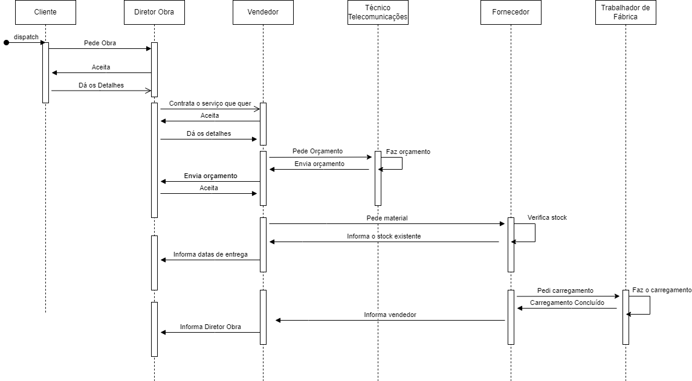

# Projeto IAA
O trabalho consiste em desenvolver um IdP (*Identity Provider*) que suporte serviços com diferentes graus de criticidade e aplique MFA, de forma dinâmica, de acordo com os requisitos do serviço e o risco percebido pelo utilizador.

## Descrição de Serviços

O sistema CRM desenvolvido para a Teka Telecomunicações é uma ferramenta abrangente projetada para gestão todas as facetas dos projetos e atividades de negócios relacionados. 

Uma característica fundamental é a capacidade de gestão um repositório de projetos, fornecendo informações detalhadas sobre cada obra, incluindo dados sobre stakeholder's, contactos com clientes diretos e indiretos (prospect's) que solicitam cotações diretamente à Teka Telecomunicações e os materiais necessários para a execução de cada projeto. Além disso, o sistema mantém informações de gestão de clientes, como endereços das sedes e filiais dos clientes.

Além disso, o sistema possui outros componentes de grande relevância como o planeamento, execução e relatório de atividades destinadas a capturar negócios relacionados com os projetos. Isso permite uma abordagem estruturada para angariar e gestão negócios, garantindo que todas as etapas do processo sejam registadas e acompanhadas de forma eficiente.

## Arquitetura

### Linguagens e Ferramentas

1. Linguagens de programação:
   - [JavaScript](https://developer.mozilla.org/pt-BR/docs/Web/JavaScript)
   - [React](https://reactjs.org/)
2. Base de dados:
   - [PL/SQL](https://www.oracle.com/database/)
3. Frameworks:
   - [OAuth2](https://oauth.net/2/)

### Entidades e relações

Atores:
- Diretor da Obra
- Vendedor
- Técnico de Telecomunicações
- Fornecedor
- Trabalhador de Fábrica

### Diagrama de Sequencial (Feito p/ Ana)

  

### Diagrama de Casos de Uso (2 casos de uso p/ Ana Vidal, 2 casos de uso p/ Simão Andrade)

### Modelo Hierárquico dos Utilizadores (Simão Andrade)

### Modelo de Controlo de Acesso

Para a implementação do controlo de acesso, foi feito um mapeamento das funções dos utilizadores para os recursos do sistema. 

Com isto, foi desenvolvida a seguinte estrutura baseada:

| Acessos                         | Vendedor | Di. da Obra | Fornecedor | Tec. Telecom | Trab. de Fábrica |
| ------------------------------- | -------- | ----------- | ---------- | ------------ | ---------------- |
| Morada e contactos dos Clientes | Sim      | Sim         | Não        | Não          | Não              |
| Contactos do diretor da obra    | Sim      | -           | Sim        | Não          | Não              |
| Morada da obra                  | Sim      | Sim         | Não        | Não          | Não              |
| Material da obra                | Sim      | Sim         | Sim        | Sim          | Sim              |
| Material em stock               | Não      | Não         | Sim        | Não          | Sim              |
| Tabela de preços                | Sim      | Sim         | Sim        | Não          | Não              |
| Escalão de desconto             | Sim      | Não         | Sim        | Não          | Não              |
| Status da obra                  | Sim      | Sim         | Não        | Não          | Não              |

## *Authentication* e *Authorization flow* (Por analisar p/ Simão Andrade)

A framework OAuth 2.0 diversos modos de obter tokens de acesso e como estes são geridos no processo de autenticação. A escolha do fluxo de autenticação depende do tipo de aplicação, nível de confiança com a aplicação cliente e a fadiga do utilizador.

Para obter uma melhor resposta a qual *flow* de autenticação usar, foram feitas as seguintes questões:

### A aplicação cliente é uma *Single-Page App*?

Dada a abundância de dados envolvidos, o sistema foi desenvolvido como uma *Multi-page App*. Isso garante que a complexidade de desenvolvimento seja mantida baixa, enquanto proporciona um tempo de carregamento inicial rápido. Isso significa que os utilizadores podem acessar informações de maneira mais imediata, sem sacrificar a eficiência ou a usabilidade do sistema.

### A aplicação cliente é o *Resource Owner*?

Como a solução da aplicação cliente é uma aplicação *web*, a abordagem onde o *Resource Owner* é o *Client* não é a mais adequada. Isso porque a aplicação cliente não é confiável com as credenciais do utilizador, podendo trazer riscos de segurança.

### A aplicação cliente é um *Web Server*?

Sim, a aplicação cliente é um *Web Server*.

### A aplicação cliente precisa de comunicar com *Resource Servers* diferentes?

Não, a aplicação cliente apenas precisa de comunicar com o *Resource Server* da Teka Telecomunicações.

Dados os requisitos do sistema e feita a análise das questões acima, o *flow* de autenticação escolhido foi o *Authorization Code*.

### Diagrama de *Authorization Code* (Simão Andrade)

## Modelo de gestão de risco

Durante o processo de autenticação, o IdP avalia o risco percebido pelo utilizador e o serviço que está a ser acedido.

### Identificação de riscos (por analisar (Ana Vidal))

Para a identificação dos riscos associados ao sistema, foi feita uma enumeração das possíveis ameaças e vulnerabilidades que podem afetar a segurança do sistema.

Ameaças:
1. Corrupção/Perda de dados associados a projetos e clientes;
2. Controlo de acesso quebrado;
3. Disponibilidade do sistema ser comprometida;
4. Acesso não autorizado a dados sensíveis;
5. Ataques de *phishing* (roubo de credenciais);
6. Ataques de *spoofing* (falsificação de identidade);

Vulnerabilidades:
1. Registo de atividades não monitorizado (logs);
2. Regras de controlo de acesso mal definidas;
3. *Password Spraying* (ataque de força bruta);
4. *Cross-site scripting* (XSS);
5. Ataques de *SQL injection*;
6. Ataques de *DDoS* (negação de serviço distribuída);
7. Ataques de *Broken Authentication*;

### Análise/Avaliação de riscos do software (Fiz as tabelas, mas falta a análise (Ana Vidal))

A partir desta enumeração, foi feita uma análise de risco para determinar a probabilidade de ocorrência e o impacto de cada risco identificado. 

A análise de risco foi feita com base numa análise quantitativa, onde:

| Probabilidade/Impacto | Muito Baixo | Baixo | Médio | Alto | Muito Alto |
| --------------------- | ----------- | ----- | ----- | ---- | ---------- |
| Improvável            | 1           | 2     | 3     | 4    | 5          |
| Pouco provável        | 2           | 4     | 6     | 8    | 10         |
| Provável              | 3           | 6     | 9     | 12   | 15         |
| Bastante provável     | 4           | 8     | 12    | 16   | 20         |
| Muito provável        | 5           | 10    | 15    | 20   | 25         |

Onde a probabilidade representa:

| Nível de probabilidade | Descrição         | Número médio de Ocorrências |
| ---------------------- | ----------------- | --------------------------- |
| Nível 1                | Improvável        | 0-1                         |
| Nível 2                | Pouco provável    | 1-2                         |
| Nível 3                | Provável          | 2-3                         |
| Nível 4                | Bastante provável | 3-4                         |
| Nível 5                | Muito provável    | 4+                          |

E o impacto representa:

| Nível de impacto | Impacto     | Descrição do impacto            |
| ---------------- | ----------- | ------------------------------- |
| Nível 1          | Muito Baixo | Um posto de trabalho parado     |
| Nível 2          | Baixo       | Um sistema/processo parado      |
| Nível 3          | Médio       | Um departamento parado          |
| Nível 4          | Alto        | Mais que um departamento parado |
| Nível 5          | Muito Alto  | A empresa parada                |

Obtendo-se a seguinte matriz de risco:

| Risco = f(Ameaça, Vulnerabilidade)                                          | Probabilidade | Impacto | Valor do Risco = (P * I) |
| --------------------------------------------------------------------------- | ------------- | ------- | ------------------------ |
| Comprometimento de dados sensíveis causados por *phishing*                  | 4             | 3       | 12                       |
| Acesso de colaborados a documentos sensíveis, por privilégios mal definidos | 1             | 2       | 2                        |
| Integridade dos dados comprometida por falta de validação de entrada        | 4             | 4       | 16                       |
| Exposição de informações sensíveis devido a falha na autenticação           | 3             | 4       | 12                       |
| Roubo de credenciais devido a ataques de força bruta                        | 3             | 4       | 12                       |

### Identificação de controlos a implementar (Simão Andrade)

Com base nos riscos anteriormente enumerados, foram identificados os controlos a implementar para mitigar os mesmos. 

A presente tabela, mostra os controlos identificados junto do novo valor do risco:

| Risco = f(Ameaça, Vulnerabilidade)                                          | Probabilidade(2) | Impacto(2) | Controlo a implementar | Novo Valor do Risco |
| --------------------------------------------------------------------------- | ---------------- | ---------- | ---------------------- | ------------------- |
| Comprometimento de dados sensíveis causados por *phishing*                  | -                | -          | -                      | -                   |
| Acesso de colaborados a documentos sensíveis, por privilégios mal definidos | -                | -          | -                      | -                   |
| Integridade dos dados comprometida por falta de validação de entrada        | -                | -          | -                      | -                   |
| Exposição de informações sensíveis devido a falha na autenticação           | -                | -          | -                      | -                   |
| Roubo de credenciais devido a ataques de força brutan                       | -                | -          | -                      | -                   |

### Pontuação de Risco de Registo de Loggins por Utlizadores (Ana Vidal)
Para um vendedor, os riscos associados ao registro de logins podem ser um pouco diferentes, pois eles podem estar mais relacionados às informações do cliente e ao acesso aos sistemas de vendas. Aqui estão alguns possíveis riscos:

1. **Exposição de informações do cliente:** Os registros de login podem conter informações sobre clientes, como histórico de compras, informações de contato e detalhes de pagamento. Se essas informações forem expostas, pode haver violações de privacidade dos clientes.

2. **Acesso não autorizado às informações de vendas:** Se os registros de login permitirem acesso não autorizado aos sistemas de vendas, pode haver um risco de manipulação de informações de vendas, como preços, estoque e dados do cliente.

3. **Risco de phishing:** Os registros de login dos vendedores podem ser alvo de ataques de phishing, nos quais os invasores tentam obter credenciais de login dos vendedores para acessar informações confidenciais ou realizar atividades maliciosas em nome do vendedor.

4. **Fraude de identidade:** Se os registros de login forem comprometidos, pode haver um risco de fraude de identidade, onde os invasores se passam pelo vendedor para realizar transações fraudulentas ou obter acesso indevido a recursos da empresa.

Agora, podemos realizar uma avaliação de risco semelhante à anterior, atribuindo valores de probabilidade e impacto para esses riscos e calculando a pontuação de risco total.

| Risco                                                   | Probabilidade | Impacto | Valor do Risco = (P * I) |
| ------------------------------------------------------- | ------------- | ------- | ------------------------ |
| Exposição de informações do cliente                     | 3             | 4       | 12                       |
| Acesso não autorizado às informações de vendas          | 4             | 3       | 12                       |
| Risco de phishing                                       | 3             | 3       | 9                        |
| Fraude de identidade                                    | 2             | 2       | 4                        |

Pontuação total de risco = 12 (exposição de informações do cliente) + 12 (acesso não autorizado às informações de vendas) + 9 (risco de phishing) + 4 (fraude de identidade)

Pontuação total de risco = 37

Portanto, a pontuação de risco para o registro de logins de um vendedor é 37. Essa pontuação indica o nível de exposição ao risco associado às atividades de registro de logins para os vendedores.
